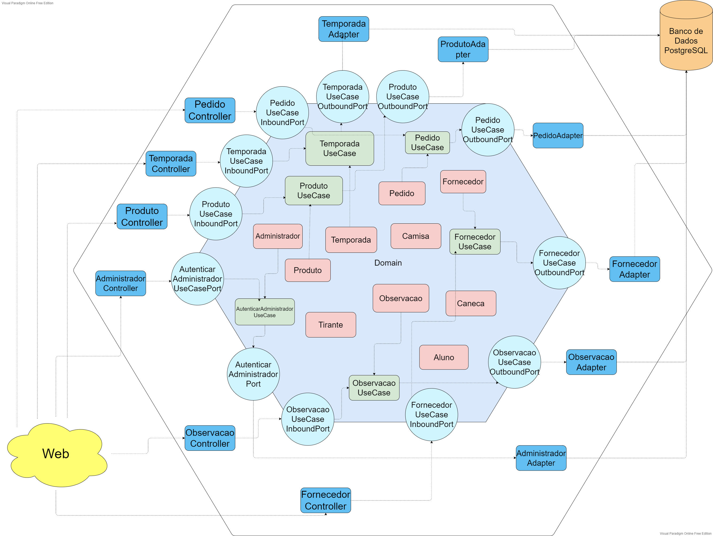

# SGP - Sistema de Gerenciamento de Pedidos

### Membros e papéis:

- Fernando Eduardo Pinto Moreira - desenvolvedor front-end;
- Gilliard Gabriel Rodrigues - desenvolvedor back-end;
- Maíla Ferreira Silva - desenvolvedora front-end;
- Samuel William Almeida Santos - desenvolvedor back-end.

### Funcional (objetivo do sistema, principais features, etc)

**Objetivo:**
Trata-se de um sistema que permite o gerenciamento de pedidos para o DACompSI, sejam eles de camisas, canecas e/ou tirantes. Podendo futuramente ser expandido com a chegada de novos produtos.

**Principais features:**

Os administradores têm uma área privada que exige autenticação via login e senha, onde conseguem:

- Gerenciar os pedidos, filtrando por tamanho, cor, curso, data, status de pagamento e situação de entrega;

- Abrir e fechar a temporada de pedidos com itens específicos;

- Criar um inventário com itens à pronta-entrega e cadastrar fornecedores.

Os clientes conseguem:

- Fazer pedidos, consultar status de pedidos através de seus códigos e também ver os itens disponíveis à pronta-entrega.

### Tecnologias

- Front-end
  - HTML
  - CSS
  - Javascript
  - Bootstrap
- Back-end
  - Java
  - Spring
  - Hibernate
- Banco de dados
  - PostgreSQL
- Deploy
  - AWS ou Heroku

### Product Backlog

- Como administrador, eu gostaria de poder iniciar temporadas de recebimento de pedidos, informando os itens que estarão à venda.

- Como administrador, eu gostaria de dar baixa de pagamento parcial ou total de pedidos

- Como administrador, eu gostaria de poder filtrar os itens dos pedidos por suas características, como tamanho, cor, curso, data, status de pagamento e situação de entrega, para fins de conferência.

- Como administrador, eu gostaria de cadastrar fornecedores com observações específicas para cada um.

- Como administrador, eu gostaria de cadastrar produtos do inventário.

- Como usuário, eu gostaria de poder consultar o inventário de produtos disponíveis à pronta-entrega.

- Como usuário, eu gostaria de acompanhar a situação do meu pedido, tendo transparência sobre a situação de pagamento e previsão de retirada.

- Como administrador, eu gostaria de poder fechar temporadas de recebimento de pedidos, gerando aviso aos clientes de que o pedido já foi repassado para a produção.

- Como administrador, eu gostaria de gerar relatórios de forma agrupada para os fornecedores a respeito dos pedidos após fechar uma temporada.

- Como administrador, eu gostaria de poder notificar os clientes a respeito do tempo de entrega previsto de cada produto de acordo com o tempo do fornecedor e também quando algum produto chegasse.

### Sprint Backlog

**História:** Como administrador, eu gostaria de cadastrar fornecedores com observações específicas para cada um.

- ✅ Projetar tela de cadastro e edição de fornecedores no Figma e validar design. [Maíla, Fernando]

- ✅ Implementar interface web. [Fernando]

- ✅ Implementar CRUD de fornecedores. [Gilliard]

- ✅ Implementar lógica das observações e histórico com fornecedores. [Gilliard]

**História:** Como administrador, eu gostaria de poder iniciar temporadas de recebimento de pedidos, informando os itens que estarão à venda.

- ✅ Projetar tela de gerenciamento de temporada no Figma e validar design. [Maíla]

- ✅ Implementar interface web. [Fernando]

- ✅ Criar e implementar rota para pesquisar temporadas existentes. [Gilliard]

- ✅ Criar e implementar rota para abrir uma nova temporada de pedidos. [Gilliard]

- ✅ Criar e implementar rota para editar informações da temporada. [Gilliard]

- ✅ Criar e implementar rota para excluir uma temporada. [Gilliard]

- ✅ Implementar regras de negócio de encerramento de temporada e contabilização de pedidos. [Gilliard]

**História:** Como administrador, eu gostaria de cadastrar produtos do inventário.

- ✅ Projetar tela com visão administrativa de produtos no Figma e validar design. [Fernando]

- ✅ Implementar interface web. [Fernando]

- ✅ Criar e implementar rota para popular o inventário. [Gilliard]

- ✅ Criar e implementar rota para editar produtos. [Gilliard]

- ✅ Criar e implementar rota para remover produtos. [Gilliard]

**História:** Como usuário, eu gostaria de poder realizar um pedido

- ✅ Projetar telas relativas ao processo de abertura de pedido no Figma e validar design. [Maíla, Fernando]

- ✅ Implementar interface web. [Fernando]

- ✅ Criar e implementar rota para criar pedido [Samuel]

**História:** Como usuário, eu gostaria de poder consultar o inventário de produtos disponíveis à pronta-entrega.

- ✅ Projetar tela de consulta do usuário no Figma e validar design. [Maíla, Fernando]

- ✅ Implementar interface web. [Fernando]

- ✅ Criar e implementar rota para mostrar apenas produtos disponíveis à pronta-entrega. [Gilliard]

**História:** Como usuário, eu gostaria de acompanhar a situação do meu pedido, tendo transparência sobre a situação de pagamento e previsão de retirada.

- ✅ Projetar tela de acompanhamento de pedidos e validar design. [Maíla]

- ✅ Implementar interface web. [Fernando]

- ✅ Criar e implementar rota para buscar pedido [Samuel]

- ✅ Implementar lógica de autenticação do código do pedido. [Gilliard]

**História:** Como administrador, eu gostaria de poder fechar temporadas de recebimento de pedidos, gerando aviso aos clientes de que o pedido já foi repassado para a produção.

- ✅ Projetar tela de acompanhamento de pedidos da temporada. [Maíla]

- ✅ Implementar interface web. [Fernando]

- ✅ Criar e testar rota para atualizar todos os pedidos pagos da temporada para serem considerados encomendados e impedir novos pedidos na temporada [Samuel, Gilliard]

**História:** Como administrador, eu gostaria de notificar os clientes a respeito do tempo de entrega específico de cada tipo de produto, de acordo com o tempo do fornecedor.

- ✅ Projetar tela de acompanhamento de pedidos da temporada. [Fernando]

- ✅ Implementar interface web. [Maíla]

- ✅ Criar e testar rota para definir o prazo de entrega dos pedidos de uma temporada. [Samuel]

**História:** Como administrador, eu gostaria de dar baixa de pagamento parcial ou total de pedidos

- ✅ Projetar tela de gerenciamento de pedidos no Figma e validar design. [Fernando]

- ✅ Implementar interface web. [Maíla]

- ✅ Criar e implementar rota para pesquisar pedidos existentes. [Samuel, Gilliard]

- ✅ Criar e implementar rota para editar pedidos. [Samuel, Gilliard]

- ✅ Implementar regras de negócio relativas às edições de pedidos e seus reflexos. [Samuel, Gilliard]

- ✅ Criar e implementar rota para remover pedidos. [Samuel, Gilliard]

**História:** Como administrador, eu gostaria de poder filtrar os itens dos pedidos por suas características, como tamanho, cor, curso, data, status de pagamento e situação de entrega, para fins de conferência.

- ✅ Implementar filtros de busca na tabela de pedidos no back-end. [Gilliard, Samuel]

- ⬜️ Implementar esses filtros no front-end. [Fernando, Maíla]

**Tarefas técnicas**

- ✅ Preparar estrutura de arquivos para arquitetura hexagonal. [Gilliard]

- ✅ Discutir e definir diagrama das classes de domínio. [Gilliard]

- ✅ Criar banco de dados no PostgreSQL. [Gilliard]

- ✅ Implementar camada de persistência. [Gilliard]

- ✅ Implementar esqueleto da arquitetura hexagonal. [Gilliard]

- ✅ Implementar autenticação e autorização de usuários. [Gilliard]

- ✅ Projetar telas de login e tela principal do administrador no Figma e validar design. [Fernando]

- ✅ Implementar telas de login, cadastro e tela principal do administrador. [Maíla]

### Documentação da arquitetura:

- A Arquitetura Hexagonal foi adotada no sistema com o objetivo de separar o domínio da tecnologia.
- A descrição abaixo explicita os componentes da arquitetura:

```
├── adapters    -> diretório contendo os adaptadores
│   ├── inbound    -> diretório contendo os adaptadores para a interface web
│   │   ├── entity   -> diretório contendo classes anotadas com Hibernate para mapeamento objeto-relacional
│   │   │   └── ...
│   │   ├── exceptionHandler   -> diretório contendo classes que capturam e montam o corpo dos erros para as respostas de requisições
│   │   │   └── ...
│   │   ├── mapper   -> diretório contendo um mapper genérico implementado com ModelMapper
│   │   │   └── ...
│   │   ├── request  -> diretório contendo classes DTOs para serem utilizados nas requisições
│   │   │   └── ...
│   │   ├── response  -> diretório contendo classes DTOs para serem utilizados nas respostas das requisições
│   │   │   └── ...
│   │   ├── AdministradorController
│   │   ├── FornecedorController
│   │   ├── ObservacaoController
│   │   ├── PedidoController
│   │   ├── ProdutoController
│   │   └── TemporadaController
│   │
│   └── outbound    -> diretório contendo os adaptadores para a camada de persistência
│       ├── repository   -> diretório contendo os repositórios que estendem a interface JpaRepository do Spring
│       │   └── ...
│       ├── AutenticarAdministradorAdapter
│       ├── CadastrarObservacaoAdapter
│       ├── FornecedorAdapter
│       ├── PedidoAdapter
│       ├── ProdutoAdapter
│       └── TemporadaAdapter
│
├── application
│   ├── core
│   │   ├── domain   -> diretório contendo as classes do domínio
│   │   ├── exception   -> diretório contendo as classes relativas às exceções personalizadas
│   │   └── usecase   -> diretório contendo as classes relativas aos serviços e regras de negócio do domínio.
│   │
│   └── ports   -> diretório contendo as portas
│       ├── in   -> diretório contendo as interfaces relativas às portas de entrada
│       └── out   -> diretório contendo as interfaces relativas às portas de saída
│
├── config   -> diretório contendo as classes de configuração do ModelMapper e dos beans do Spring
└── SgpApplication

```

Os arquivos referentes ao front-end (HTML, CSS, JS e imagens) estão no diretório _resources_.

### Diagrama da Arquitetura Hexagonal



### Diagrama de Classes


