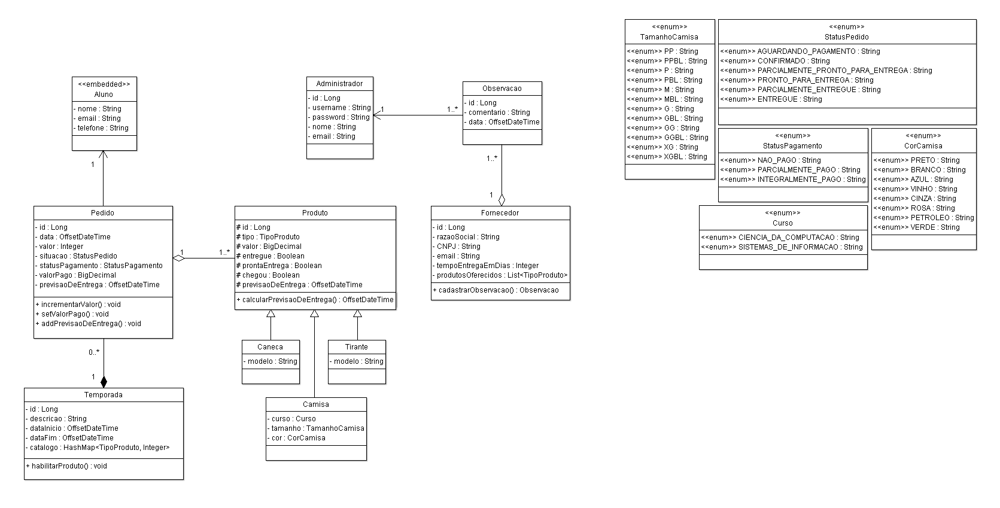

# SGP - Sistema de Gerenciamento de Pedidos

### Membros e papéis:

- Fernando Eduardo Pinto Moreira - desenvolvedor front-end;
- Gilliard Gabriel Rodrigues - desenvolvedor back-end;
- Maíla Ferreira Silva - desenvolvedora front-end;
- Samuel William Almeida Santos - desenvolvedor back-end.

### Funcional (objetivo do sistema, principais features, etc)
**Objetivo:** 
Trata-se de um sistema que permite o gerenciamento de pedidos para o DACompSI, sejam eles de camisas, canecas e/ou tirantes. Podendo futuramente ser expandido com a chegada de novos produtos.

**Principais features:**

Os administradores têm uma área privada que exige autenticação via login e senha, onde conseguem:

- Gerenciar os pedidos, filtrando por tamanho, cor, curso, data, status de pagamento e situação de entrega;

- Abrir e fechar a temporada de pedidos com itens específicos;

- Criar um inventário com itens à pronta-entrega e cadastrar fornecedores.

Os clientes conseguem:

- Fazer pedidos, consultar status de pedidos através de seus códigos e também ver os itens disponíveis à pronta-entrega.

### Tecnologias 
- Front-end
	- HTML
	- CSS
	- Javascript
	- Bootstrap
- Back-end
	- Java
	- Spring
	- Hibernate
- Banco de dados
	- PostgreSQL
- Deploy
  - AWS ou Heroku

### Diagrama de Classes

